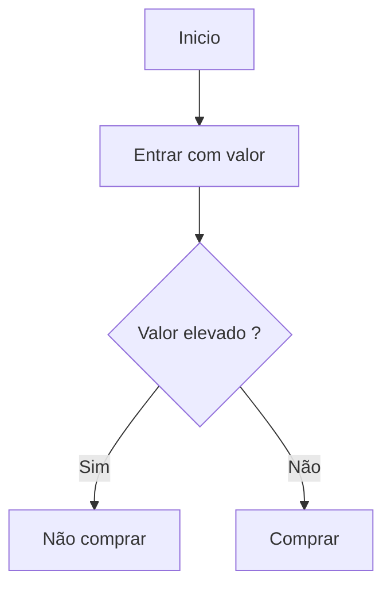

# Markdown


:smiley: Tudo que você  precisa saber sobre essa linguagem de marcação !


<!-- Headings  -->

```
<!-- Headings  -->
# H1
## H2
### H3
#### H4
##### H5
###### H6
```


# H1
## H2
### H3
#### H4
##### H5
###### H6

<!-- DIVIDERS-->

```
<!-- Divisões  -->

---

***
```


---

***
```


<!-- Emphasis -->

<!-- Você pode adicionar ênfase colocando o texto em negrito ou itálico.-->


<!-- Negrito -->

**Strong**

<!-- Itáĺico -->

_Itáĺico_

*Itáĺico*
***
```


<!-- Negrito -->

**Strong**

<!-- Itáĺico -->

_Itálico_

*Itálico*
***
```
<!-- Lista Ordenada -->

1. Item 1
2. item 2
   1. item 2.1  
3. item 3

```


<!-- Lista Ordenada -->

1. Item 1
2. item 2
   1. item 2.1  
3. item 3

```
<!-- Lista não Ordenada -->

* Item 1
* item 2
  * item 2.1
* item 3

```


<!-- Lista não Ordenada -->

* Item 1
* item 2
  * item 2.1
* item 3
```
<!-- Lista chechbox -->

- [ ] Item 1
- [x] item 2
- [ ] item 3

```


<!-- Lista chechbox -->

- [ ] Item 1
- [x] item 2
- [ ] item 3

```
<!-- citação -->

> citação alinhada
> > citação alinhada
```


<!-- citação -->

> citação alinhada
> > citação alinhada

<!-- Inline code -->
```
<!-- Inline code -->

Para instalar essa lib rode  `yarn install`
```


Para instalar essa lib rode  `yarn install`

<!-- Code block -->
``` 
<!-- Code block -->

Para instalar essa lib rode 
    ```bash 
    `yarn install` 
    ```
```


Para instalar essa lib rode 
```bash 
    `yarn install` 
```

```
<!-- Tabelas -->

| Name |    Date    |
| ---- | ---------  |
|  A   | 10/05/2020 |
|  A   | 10/05/2020 |
|  A   | 10/05/2020 |
|  A   | 10/05/2020 |
|  A   | 10/05/2020 |
|  A   | 10/05/2020 |
|  A   | 10/05/2020 |
|  A   | 10/05/2020 |
```


<!-- Tabelas -->

| Name |    Date    |
| ---- | ---------  |
|  A   | 10/05/2020 |
|  A   | 10/05/2020 |
|  A   | 10/05/2020 |
|  A   | 10/05/2020 |
|  A   | 10/05/2020 |
|  A   | 10/05/2020 |
|  A   | 10/05/2020 |
|  A   | 10/05/2020 |

<!-- links -->

```
<!-- links -->

[ link para algum lugar ](http://github.com "Github" ) 

```


[ link para algum lugar ](http://github.com "Github" ) 

```
<!-- Imagens - Gifs  -->

Quick Chat for iOS is a real time chat app written in Swift 5 using Firebase.[ link para o repositorio ](https://github.com/aslanyanhaik/Quick-Chat "Quick Chat for iOS" )  
```


<!-- Imagens - Gifs  -->

Quick Chat for iOS is a real time chat app written in Swift 5 using Firebase.[ link para o repositorio ](https://github.com/aslanyanhaik/Quick-Chat "Quick Chat for iOS" ) 


<!-- Graficos - Diagramas -->

Para criar diagramas e visualizações usando texto e código utilizamos o [Mermaid](https://mermaid-js.github.io/mermaid/#/). Sucintamente o mermaid constitui em uma ferramenta de diagramação e gráficos baseada em Javascript que renderiza definições de texto inspiradas em Markdown para criar e modificar diagramas dinamicamente. Uma maneira para editar e criar diagramas de forma online é o [Mermaid Live Editor](https://mermaid-js.github.io/mermaid-live-editor/edit#pako:eNpVkE1qw0AMha8itEohvoAXhcZOsgmk0Ow8WQiPnBmS-WEsU4Ltu3ccU2i1kt77nhAasQ2ascRbomjgUisPuT6ayiTbi6P-CkXxPh1ZwAXPzwl2m2OA3oQYrb-9rfxugaAaTwvGIMb6-7xa1St_9jxB3ZwoSojXv87lO0ywb-ynyev_OyZxTh2ajsqOipYSVJReCG7RcXJkdT59XBSFYtixwjK3mjsaHqJQ-TmjQ9QkvNdWQsJS0sBbpEHC19O3v_PK1JbyI9wqzj8k-lxH). A baixo temos um floxograma feito com esta ferramenta :



